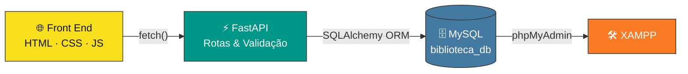

<div align="center">


### 🧑‍💻 SW-II · Sistemas Web II · 3º Bimestre

**Uma API REST para gerenciamento de livros — do banco de dados à interface web.**

[](https://www.python.org/)
[](https://fastapi.tiangolo.com/)
[](https://www.mysql.com/)
[](https://www.sqlalchemy.org/)
[](https://developer.mozilla.org/docs/Web/HTML)
[](https://developer.mozilla.org/docs/Web/CSS)
[](https://developer.mozilla.org/docs/Web/JavaScript)

<br/>


</div>

<br/>

## 📖 Sobre o projeto

> 🎓 Atividade avaliativa da disciplina de **Sistemas Web II**, com o objetivo de construir, em etapas práticas, uma aplicação completa para gerenciamento de livros — API, banco de dados e interface web.

Cada livro cadastrado possui:

| Campo | Tipo | Descrição |
| :--: | :--: | --- |
| 🆔 `id` | `int` | Identificador único, gerado automaticamente |
| 📕 `titulo` | `str` | Título do livro |
| ✍️ `autor` | `str` | Autor do livro |
| 📅 `ano_publicacao` | `int` | Ano de publicação |
| 📗 `disponivel` | `bool` | Situação de disponibilidade |

<br/>

## 🗂️ Sumário

- [Sobre o projeto](#-sobre-o-projeto)
- [Funcionalidades](#-funcionalidades)
- [Arquitetura](#%EF%B8%8F-arquitetura)
- [Stack utilizada](#%EF%B8%8F-stack-utilizada)
- [Como rodar o projeto](#-como-rodar-o-projeto)
- [Endpoints da API](#-endpoints-da-api)
- [Estrutura de pastas](#-estrutura-de-pastas)
- [Roadmap](#-roadmap)
- [Estatísticas](#-estatísticas-do-repositório)
- [Autor](#-autor)

<br/>

## ✨ Funcionalidades

CRUD completo, com validação de dados e tratamento de erros HTTP:

| | Operação | Método | Rota | Descrição |
| :--: | --- | :--: | --- | --- |
| 🟢 | **Create** | `POST` | `/livros` | Cadastra um novo livro |
| 🔵 | **Read** | `GET` | `/livros` | Lista todos os livros |
| 🔵 | **Read** | `GET` | `/livros/{id}` | Consulta um livro específico |
| 🟠 | **Update** | `PUT` | `/livros/{id}` | Atualiza os dados de um livro |
| 🔴 | **Delete** | `DELETE` | `/livros/{id}` | Remove um livro |

<br/>

## 🏗️ Arquitetura



<br/>

## ⚙️ Stack utilizada

<div align="center">

| Camada | Tecnologias |
| --- | --- |
| **Back End** | Python · FastAPI · Uvicorn · Pydantic |
| **Banco de Dados** | MySQL · SQLAlchemy · PyMySQL · XAMPP · phpMyAdmin |
| **Front End** | HTML5 · CSS3 · JavaScript (Fetch API) |
| **Ferramentas** | VS Code · Git & GitHub · Postman/Insomnia |

</div>

<br/>

## 🚀 Como rodar o projeto

<details>
<summary><b>1️⃣ Clone o repositório</b></summary>

```bash
git clone https://github.com/estevaolocks/nova_api.git
cd nova_api
```
</details>

<details>
<summary><b>2️⃣ Crie e ative o ambiente virtual</b></summary>

```bash
python -m venv venv

# Windows
venv\Scripts\activate

# Linux / macOS
source venv/bin/activate
```
</details>

<details>
<summary><b>3️⃣ Instale as dependências</b></summary>

```bash
pip install -r requirements.txt
```
</details>

<details>
<summary><b>4️⃣ Configure o banco de dados</b></summary>

1. Inicie o **Apache** e o **MySQL** pelo XAMPP;
2. Acesse o **phpMyAdmin** e importe o arquivo `database/biblioteca_db.sql`;
3. Crie o arquivo `.env` na raiz do projeto:

```env
DB_USER=root
DB_PASSWORD=
DB_HOST=localhost
DB_PORT=3306
DB_NAME=biblioteca_db
```
</details>

<details>
<summary><b>5️⃣ Execute a aplicação</b></summary>

```bash
uvicorn main:app --reload
```

Acesse a documentação interativa em:

```
http://127.0.0.1:8000/docs
```
</details>

<br/>

## 📡 Endpoints da API

```http
GET     /                     → status da API
POST    /livros                → cadastra um livro
GET     /livros                → lista todos os livros
GET     /livros/{id}           → busca um livro pelo id
PUT     /livros/{id}           → atualiza um livro
DELETE  /livros/{id}           → exclui um livro
```

<br/>

## 📁 Estrutura de pastas

```
📦 api-de-livros
├── 📂 database/
│   └── biblioteca_db.sql
├── 📂 static/
│   ├── index.html
│   ├── style.css
│   └── script.js
├── 📂 app/
│   ├── main.py
│   ├── models.py
│   ├── schemas.py
│   └── database.py
├── requirements.txt
├── .env.example
└── README.md
```

<br/>

## 🧭 Roadmap

- [x] 🟦 Fundação — ambiente, dependências e conexão com o MySQL
- [x] 🟩 Modelo `Livro`, schemas e rotas `POST` / `GET`
- [ ] 🟧 Rotas `PUT` / `DELETE` e tratamento de erros
- [ ] 🟥 Interface web completa (HTML, CSS, JavaScript)

<br/>

## 👤 Autor

<div align="center">


**Estevão Locks**

[](https://github.com/estevaolocks)
[](https://linkedin.com/in/estevao-locks)
[](mailto:estevao.locks11@gmail.com)

<br/>


---

**📚 Projeto desenvolvido para a disciplina de Sistemas Web II · 3º Bimestre**

<sub>Feito com ☕, FastAPI e algumas queries SQL teimosas.</sub>

</div>